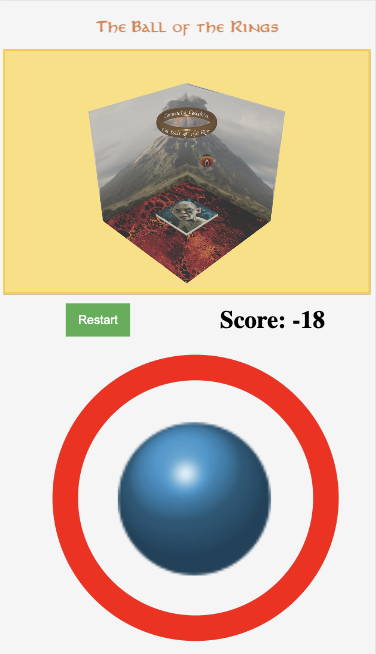

The Ball of the Rings (italian only)
====================================

Il progetto è la riproposizione in grafica 3D del videogioco [Hit The Island](https://apps.apple.com/it/app/hit-the-island/id1644376309) sviluppato da Voodoo. Il gioco si svolge all'interno di un cubo, il giocatore controlla una piattaforma posta alla base del cubo e deve evitare di far cadere la palla sul pavimento del cubo. Sul soffitto è presente un segnapunti che, toccato dalla pallina, farà guadagnare un punto al giocatore e, contestualmente, aumentare la velocità della palla. L'obiettivo è quello di totalizzare più punti possibile.

Descrizione dell'applicazione
-----------------------------

Dopo aver scaricato il codice sorgente del progetto è necessario avviare il file index.html. A questo punto la pagina visualizzata sarà la seguente: 

 

Nella parte sinistra della pagina è presente il canvas dove sarà avviato graficamente il gioco, mentre nella parte destra è presente il pulsante Start per avviare il gioco, il punteggio e le impostazioni.

Una volta premuto il tasto start verrà avviato il gioco nella parte sinistra:

### Impostazioni

Le impostazioni consentono di regolare alcuni aspetti del gameplay e della grafica. Le prime sono due checkboxes per la gestione del gameplay:

*   **Stop game on floor reached**: a causa della difficoltà imposta dalla natura del gioco non è raro perdere in breve tempo. Per questo è stata introdotta questa modalità semplificata che decrementa il punteggio invece di bloccare il gioco quando la palla colpisce il terreno;
*   **Play sound effect**: nel gioco sono presenti diversi effetti sonori (es. quando la palla tocca le pareti) oltre alla soundtrack in sottofondo, con questa opzione è possibile disabilitarli completamente.

Sono presenti inoltre delle impostazioni per la gestione grafica:

*   **FPS**: tramite questo menù a tendina si può modificare il numero di fotogrammi al secondo. Di default è impostato a 60 in quanto la maggioranza dei display sono a 60 Hz, è comunque possibile diminuire o aumentare la frequenza a 12, 24, 30, 90 o 120.
*   **Camera e Luci**: tramite la libreria dat.gui.js è stata aggiunta la possibilità di modificare le variabili per camera e luci, oltre alla modifica del field of view.

### Input utente

L'utente può controllare la piattaforma tramite i tasti WASD o con il mouse se sta giocando da desktop, mentre da mobile può utilizzare il touch tramite il joystick virtuale.  

Scelte progettuali
------------------

Per la creazione delle mesh è stato utilizzato Blender 3.3.0, gli oggetti sono stati poi esportati in .obj e i rispettivi materiali in .mtl.

Sono stati utilizzati il contesto webgl per il canvas, un vertex shader e un fragment shader, il tutto per la gestione della camera, per l'applicazione delle texture sugli oggetti e la gestione delle luci.

La parte principale del progetto è l'engine che è suddiviso in vari file a seconda del compito:

*   **Mesh Loader**: prende in input il file JSON scene.json, dove sono presenti i riferimenti ai file .obj e .mtl generati da Blender, e genera oggetti di tipo PhysicalObject, il tutto utilizzando la libreria mesh\_utils.js;
*   **Physical Object**: classe che gestisce la fisica degli oggetti, le collisioni fra di essi e avvia il render su ciascuno;
*   **Player Controller**: controlla gli input utente, sia con tastiera/mouse per desktop che con touch per mobile;
*   **Shaders Manager**: gestisce e calcola tutti i parametri relativi sia al vertex shader che al fragment shader utilizzando la libreria m4.js

Le particolarità del progetto si individuano particolarmente nella gestione della fisica degli oggetti, in particolare ciò che riguarda le bounding box e le collisioni. Queste ultime sono diverse e di vario genere a seconda del tipo di oggetto in questione.

Un'altra particolarità risiede nella gestione degli assi, infatti a differenza del gioco originale, sviluppato in 2D e quindi con soli due assi da gestire, qua è necessario che la velocità e l'accelerazione della palla tengano conto di tutti e tre gli assi. Ad esempio quando la palla tocca le pareti bisogna suddividere la velocità proporzionalmente in tutti e tre gli assi. Inoltre vengono modificate l'andatura, la velocità e l'accelerazione della palla a seconda del punteggio.

È stata inoltre gestita la scena tramite file JSON, è possibile quindi aggiungere/togliere elementi facilmente.

Ambientazione del gioco
-----------------------

Dal nome dell'applicazione si può notare che il gioco è stato ambientato nel contesto de "Il Signore degli Anelli", infatti tutte le mesh, i suoni, i font e le immagini richiamano quel tipo di ambientazione.